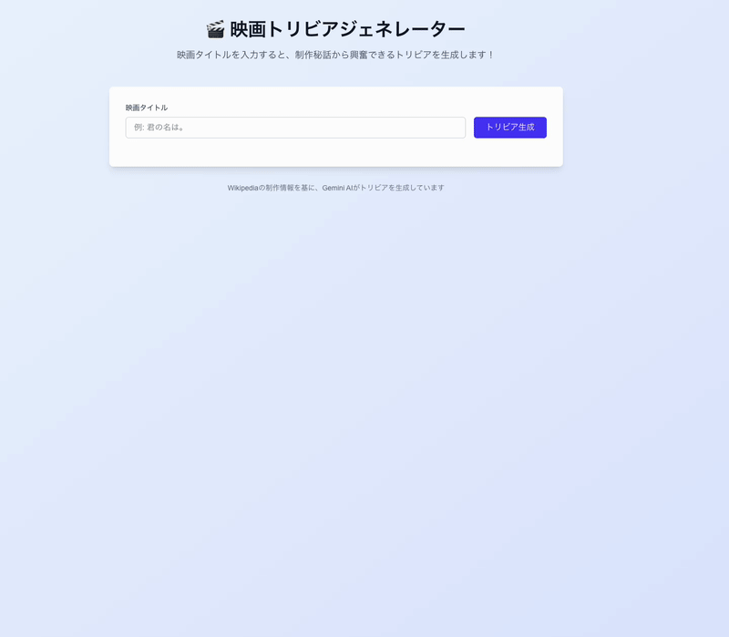

# 🎬 映画トリビアジェネレーター

日本語Wikipediaから映画の制作情報を取得し、Google Gemini AIを使って興奮できるトリビアを生成するNext.jsアプリケーションです。

## ✨ 機能

- 📝 映画タイトル入力による自動トリビア生成
- 🔍 Wikipedia制作情報の自動スクレイピング
- 🤖 Gemini AIによる魅力的なトリビア作成
- ⭐️ **AIによる興味深さレベル自動評価（1-5段階）**
- 🧠 評価理由の表示機能
- 💡 映画が見つからない場合の智能的な提案機能
- 🎨 美しいカード型UIデザイン
- 📱 レスポンシブ対応

## 🛠️ 技術スタック

- **Frontend**: Next.js 15.3.3 (App Router) + React 19
- **Styling**: Tailwind CSS 4.1
- **AI**: Google Gemini 1.5 Flash
- **Web Scraping**: Puppeteer
- **Language**: TypeScript
- **Development**: Turbopack

## 🚀 セットアップ

### 1. 依存関係のインストール

```bash
npm install
```

### 2. 環境変数の設定

`.env.local` ファイルを作成し、Gemini APIキーを設定：

```bash
GEMINI_API_KEY=your_gemini_api_key_here
```

### 3. 開発サーバーの起動

```bash
npm run dev
```

ブラウザで [http://localhost:3000](http://localhost:3000) を開いてアプリを確認できます。

## 🎥 デモ

### 基本的な使用方法


*成功例：「となりのトトロ」でトリビア生成*


## 📝 使用方法

1. 映画タイトルを入力（例：「君の名は。」「となりのトトロ」）
2. 「トリビア生成」ボタンをクリック
3. AIが生成した驚きのトリビアを楽しむ
4. 詳細な制作情報も確認可能

### 提案機能

映画が見つからない場合、関連する映画の候補が自動で表示されます：
- 「スターウォーズ」→「スター・ウォーズ エピソード4/新たなる希望」など
- 「アバター」→「アバター (2009年の映画)」など

## 🏗️ プロジェクト構造

```
src/
├── app/
│   ├── api/
│   │   └── generate-trivia/
│   │       └── route.ts          # メインAPI（スクレイピング+AI生成）
│   ├── page.tsx                   # フロントエンドUI
│   ├── layout.tsx                 # レイアウト
│   └── globals.css                # グローバルスタイル
```

## 🔧 開発コマンド

```bash
# 開発サーバー起動（Turbopack使用）
npm run dev

# プロダクションビルド
npm run build

# プロダクションサーバー起動
npm start

# Lint実行
npm run lint

# テスト実行
npm test

# テスト（監視モード）
npm run test:watch

# デモGIF作成ガイド表示
npm run demo

# 録画ファイルからGIF作成
npm run demo:convert <録画ファイル> <出力名>

# シンプルGIF変換（推奨）
npm run gif <録画ファイル> <出力名> [サイズ]
```

## 📹 GIF作成手順（開発者向け）

UIのデモGIFを作成する場合：

1. **開発サーバー起動**
   ```bash
   npm run dev
   ```

2. **画面録画**
   - macOS: `Shift + Cmd + 5` でスクリーンレコーディング
   - Windows: ゲームバー（`Win + G`）またはOBS
   - Linux: `recordmydesktop` または `kazam`

3. **GIF変換**
   ```bash
   # ffmpegを使用（推奨・高品質）
   ffmpeg -i recording.mov -vf "fps=10,scale=800:-1:flags=lanczos,palettegen" palette.png
   ffmpeg -i recording.mov -i palette.png -filter_complex "fps=10,scale=800:-1:flags=lanczos[x];[x][1:v]paletteuse" demo/ui-demo.gif
   
   # シンプルな変換（品質は落ちるが簡単）
   ffmpeg -i recording.mov -vf "fps=10,scale=800:-1" demo/ui-demo.gif
   
   # またはオンラインツール（cloudconvert.com等）を使用
   ```

4. **最適化**
   ```bash
   # gifsicleで圧縮（オプション）
   gifsicle -O3 --resize-fit 800x600 demo/ui-demo.gif -o demo/ui-demo-optimized.gif
   ```

### トラブルシューティング

**FFmpegエラーが出る場合:**
```bash
# シンプルな変換を試す
npm run gif recording.mov ui-demo

# または直接FFmpegで
ffmpeg -i recording.mov -vf "fps=10,scale=800:-1" demo/ui-demo.gif
```

**ファイルサイズが大きい場合:**
```bash
# フレームレートを下げる
ffmpeg -i input.mov -vf "fps=8,scale=600:-1" output.gif

# 品質を下げる
gifsicle -O3 --lossy=80 --resize-fit 600x400 input.gif -o output.gif
```

## 🎯 API仕様

### `POST /api/generate-trivia`

**リクエスト:**
```json
{
  "movieTitle": "君の名は。"
}
```

**レスポンス（成功）:**
```json
{
  "movieTitle": "君の名は。",
  "trivia": "新海誠監督は当初「夢と知りせば」というタイトルを...",
  "interestLevel": 4,
  "reasoning": "タイトル決定の意外な経緯と監督の心境変化が興味深い",
  "productionInfo": "本作の着想は、新海が東日本大震災発生後の..."
}
```

**レスポンス（提案あり）:**
```json
{
  "error": "映画が見つかりませんでした",
  "suggestions": ["スター・ウォーズ エピソード4/新たなる希望", ...],
  "message": "以下の映画はいかがですか？"
}
```

## 🎨 UI特徴

- **トリビアカード**: グラデーション背景、ホバーエフェクト、興味深さ表示（⭐️×5）
- **制作情報**: 展開可能な詳細カード
- **エラーハンドリング**: クリック可能な映画提案
- **レスポンシブ**: モバイル対応デザイン

### ⭐️ 興味深さレベル評価
トリビアカードに表示される星評価は、Gemini AIがトリビアの興味深さを1-5段階で自動評価した結果です：

- **⭐️⭐️⭐️⭐️⭐️ (5点)**: 超驚き！誰も知らない秘話、制作現場の奇跡的エピソード
- **⭐️⭐️⭐️⭐️☆ (4点)**: とても興味深い、制作の重要な裏話や意外な事実
- **⭐️⭐️⭐️☆☆ (3点)**: 面白い、一般的でない制作背景や工夫
- **⭐️⭐️☆☆☆ (2点)**: やや興味深い、基本的な制作情報
- **⭐️☆☆☆☆ (1点)**: 普通、よく知られた一般的な情報

AIが評価した理由も「AI評価理由」として表示されます。

## 🌟 特別な実装

- **日本語特化**: 日本語Wikipedia専用の最適化
- **智能的検索**: 映画ページとシリーズページの自動判別
- **エラー処理**: 曖昧な入力に対する提案機能
- **パフォーマンス**: Turbopackによる高速開発ビルド

## ⚖️ 利用規約・法的事項

### スクレイピングについて
- Wikipediaの公開情報のみを取得
- 教育・エンターテイメント目的での利用
- 過度な負荷をかけない設計
- robots.txt及びWikipediaの利用規約に準拠

### 免責事項
- 本アプリケーションは教育目的で作成されています
- スクレイピング機能の商用利用は推奨しません
- 利用者は各サイトの利用規約を遵守してください
- データの正確性について保証はありません

### 推奨事項
- **個人利用・学習目的**での使用を推奨
- **大量リクエスト**は控えてください
- **商用利用**前は法的確認を行ってください

## 📄 ライセンス

このプロジェクトはMITライセンスの下で公開されています。

**注意**: MITライセンスはコード利用の自由を提供しますが、スクレイピング対象サイトの利用規約は別途遵守が必要です。
